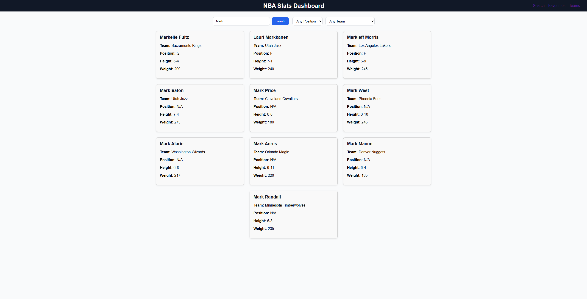
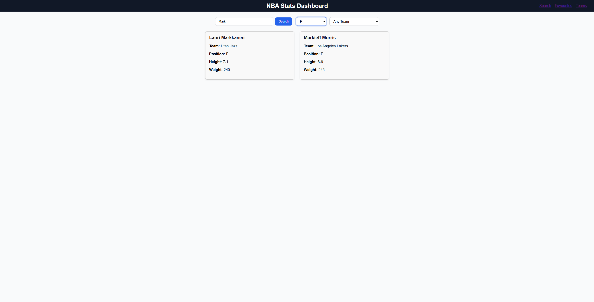
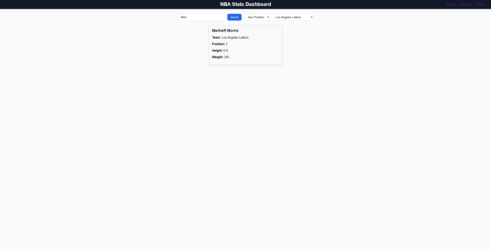
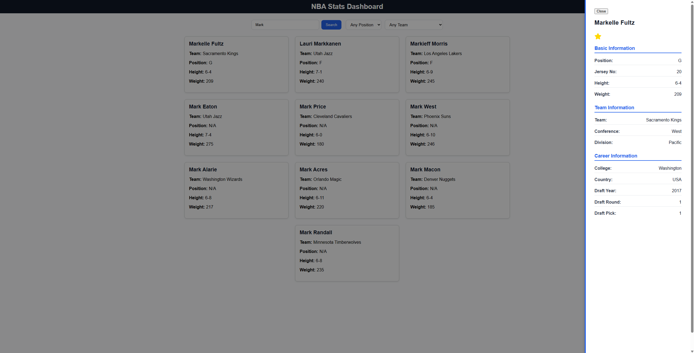
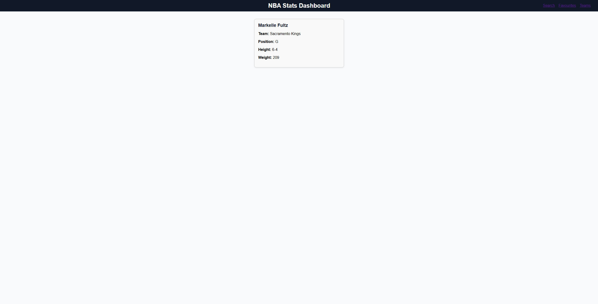
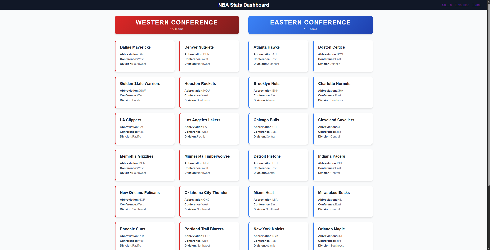

# NBA Player Directory

---
## Application Screenshots

<p align="center">
  
  <br/>
  
  <br/>
  
  <br/>
  
  <br/>
  
  <br/>
  
</p>

## Project Overview

The NBA Player Directory is a client-side single-page application (SPA) built with **React** that allows users to seamlessly explore career information for active NBA players and teams. The application successfully integrates with the **Balldontlie API** to fetch dynamic data and uses local storage for data persistence.

## Motivation

As a massive NBA fan, I wanted to build a clean interface to search for active/inactive players and teams without the visual noise of other sites. I decided to build it in React to practice working with external APIs and managing application state.

**Live Demo:** [Click here to see the app live!](https://nba-stats-dashboard-kj3l7qxz3-tyreses-projects-ef433e24.vercel.app/)

## Challenges & What I learned

The BallDontLie API was straightforward to use due to its well-written documentation, but formatting and integrating the data into the UI took me some effort. I had to handle loading states and missing data. This taught me how to write cleaner and more reliable asynchronous code using fetch and React hooks.

I also hadn't considered at first that some players would be returned who had composite positions such as G-F rather than just one position. This meant that I had to rework the filtering system to also consider those players, as at first they'd be completely removed from the page rather than being filtered properly.

## Key Features

The application is structured around three main views:

  * **Search Page:**
      * **Dynamic Player Search:** Users can search for any active NBA player and view their career information.
      * **Advanced Filtering:** Filter search results based on a player's **position** (including handling composite positions like G-F) or by their **current team**.
      * **API Integration:** Successfully fetches player and team data from the external Balldontlie API.
  * **Favourites Page:**
      * **Player Favourites:** Users can favourite any player with a single click.
      * **Local Storage Persistence:** Favourited players persist across sessions by utilizing **local storage** for data management.
      * **Dedicated View:** A separate page to view and manage the user's complete list of favourited players.
  * **Team Page:**
      * **Team Directory:** A comprehensive page to view a directory of all active NBA teams.

## Scope and Current Data Limitations

Due to API paywall limitations, this project is currently scoped to display **player career information** (e.g., name, team, position) and **team directories**. Integration for detailed, per-game player statistics is an planned future enhancement.

## Technology Stack

| Category | Technology | Description |
| :--- | :--- | :--- |
| **Frontend Framework** | **React** (JavaScript, HTML, CSS) | Used for building the dynamic, component-based user interface. |
| **Data Source** | **Balldontlie API** | A public API used for fetching NBA player and team data. |
| **State/Data** | **Local Storage** | Used to persist the user's list of favourited players across browser sessions. |

## Setup and Local Installation

### Prerequisites

  * [Node.js](https://nodejs.org/en/) (which includes npm)

### Installation Steps

1.  **Clone the Repository:**

    ```bash
    git clone [https://github.com/TyreseFurtado/nba-player-directory]
    cd nba-stats-dashboard
    ```

2.  **Install Dependencies:**

    ```bash
    npm install
    ```

3.  **Run the Application Locally:**

    ```bash
    npm start
    ```

    The application will open automatically in your browser at `http://localhost:3000`.

-----

## Future Enhancements

* **Detailed Player Stats:** Upon upgrading API access, integrate detailed, per-game player statistics into player profiles.
* **UI/UX Refinement:** Implement improved styling and accessibility features.

## Author and Contact

* **Tyrese Furtado**
* GitHub: [TyreseFurtado](https://github.com/TyreseFurtado)


**Note to Recruiter:** This project demonstrates core proficiency in React development, including state management, API integration, routing (Search, Teams, Favourites), and data persistence—key skills for a Software Engineering Intern.